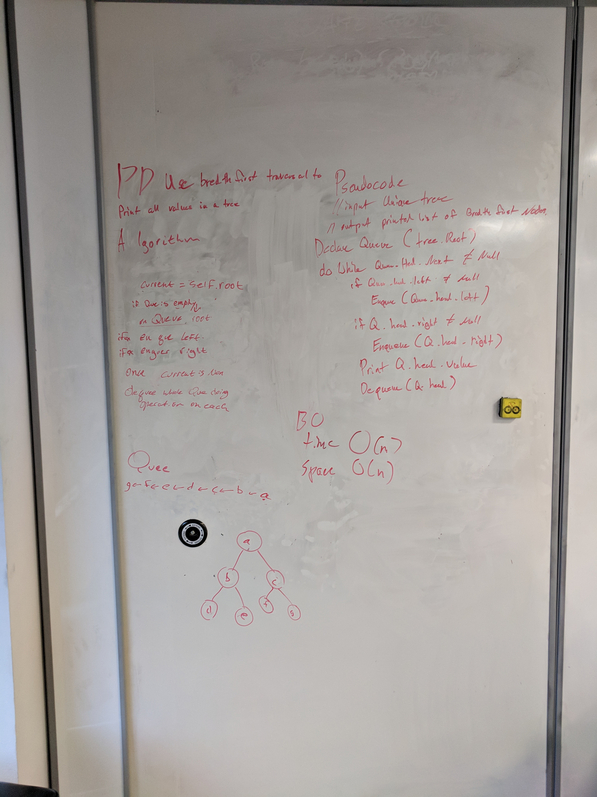

# Breadth-first Traversal

A whiteboard challenge intended to help us understand data structures.

Breadth first traversal or Breadth first search is an algorithm intended to move through a tree or graph structure one level at a time. The algorithm searches everything at one depth before moving on to the next.

## Challenge

Write a function called breadthFirstTraversal which takes a Binary Tree as its unique input. Without utilizing any of the built-in methods available to your language, traverse the input tree using a Breadth-first approach; print every visited node's value.

## Solution

Using my partial tree implementation from earlier I leveraged a queue structure to pass all the children of a row in then dequeue them out before moving on. This maintains a breadth first approach and could be easily modified to provide level order information as well.

