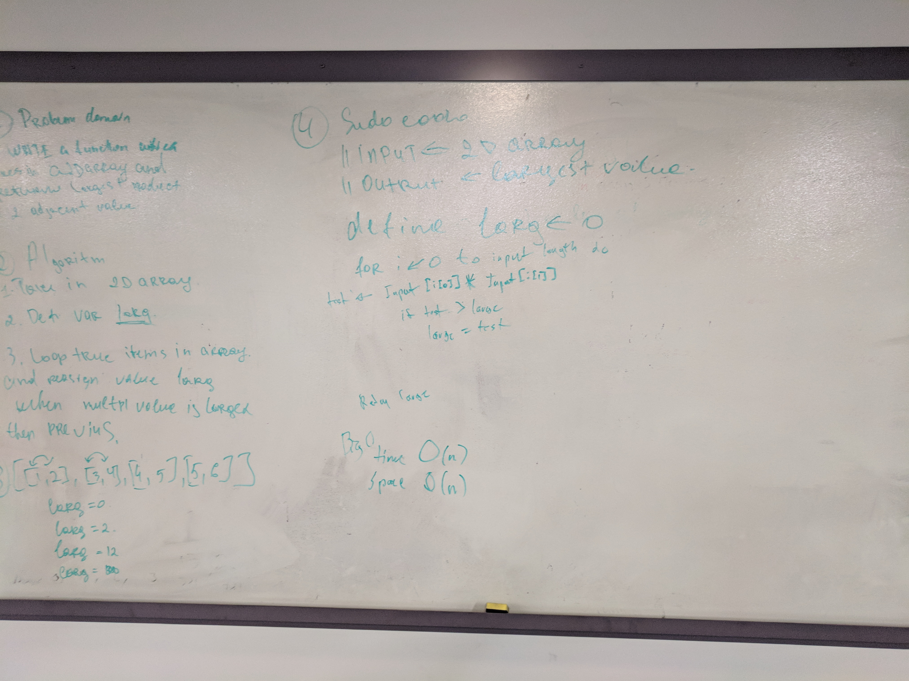

# Binary Search
A whiteboard challenge intended to help us understand data structures. 

## Challenge
Write a function called LargestProduct which takes in a 2D array. Without utilizing any of the built-in methods available to your language, retan the largest product of 2 adjacent values within the 2D array.

## Solution

