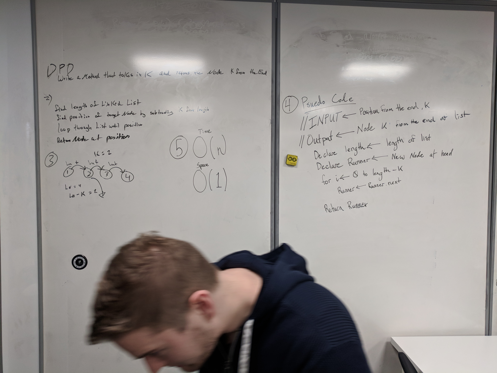
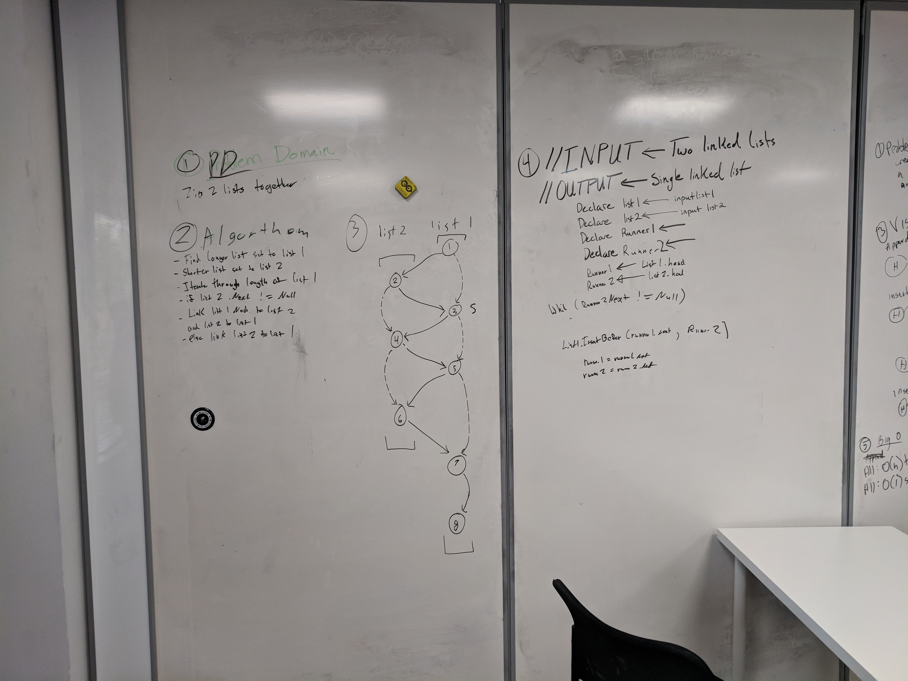
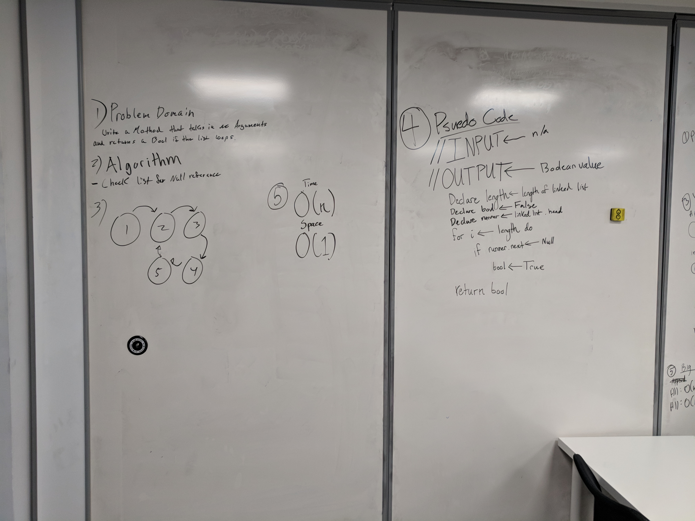

# Linked List
A data structure chalnge to help us understand the 

## Implementation 
Reflecting back on the linked list lecture in class, implement a Singly linked list within Visual Studio. Implement a singlyLinkedList with the following methods:

O(1) - .Add() - adds a node to the front of the linked list
O(n) - .Find() - Finds a specific value in the linked list

## Challenge 1
Write the following methods for the Linked List class:
.append(value) which adds a new node with the given value to the end of the list
.insertBefore(value, newVal) which add a new node with the given newValue immediately before the first value node
.insertAfter(value, newVal) which add a new node with the given newValue immediately after the first value node

## Challenge 2
Write a method for the Linked List class called kthFromEnd which takes a number, k, as an argument. Return the node that is k from the end of the linked list. You have access to the Node class and all the properties on the Linked List class as well as the methods created in previous challenges. 

## Challenge 3
Write a function called mergeLists which takes two linked lists as arguments. Zip the two linked lists together into one so that the nodes alternate between the two lists and return a reference to the head of the single list. Try and keep additional space down to O(1). You have access to the Node class and all the properties on the Linked List class as well as the methods created in previous challenges.

## Challenge 4
Write a method for the Linked List class called hasLoop which takes no arguments. Return a boolean that indicates whether or not a circular reference or loop is present in the linked list. Your implementation must not use any additional memory or modify the nodes of the linked list. You have access to the Node class and all the standard properties on the Linked List class as well as the methods created in previous challenges.
Note: Length or Size are *not* included in standard properties for a LL.

## Solution

