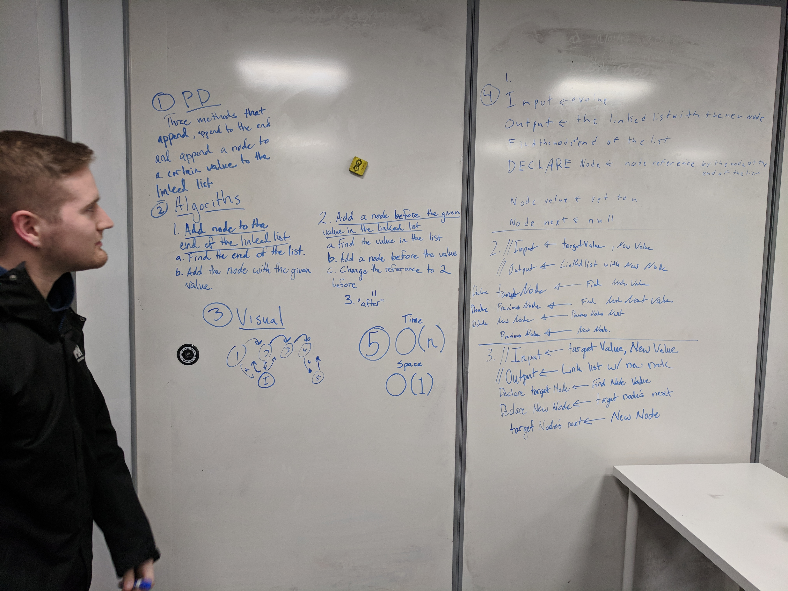

# Binary Search
A data structure chalnge to help us understand the 

## Challenge
Reflecting back on the linked list lecture in class, implement a Singly linked list within Visual Studio. Implement a singlyLinkedList with the following methods:

O(1) - .Add() - adds a node to the front of the linked list
O(n) - .Find() - Finds a specific value in the linked list

## Solution
