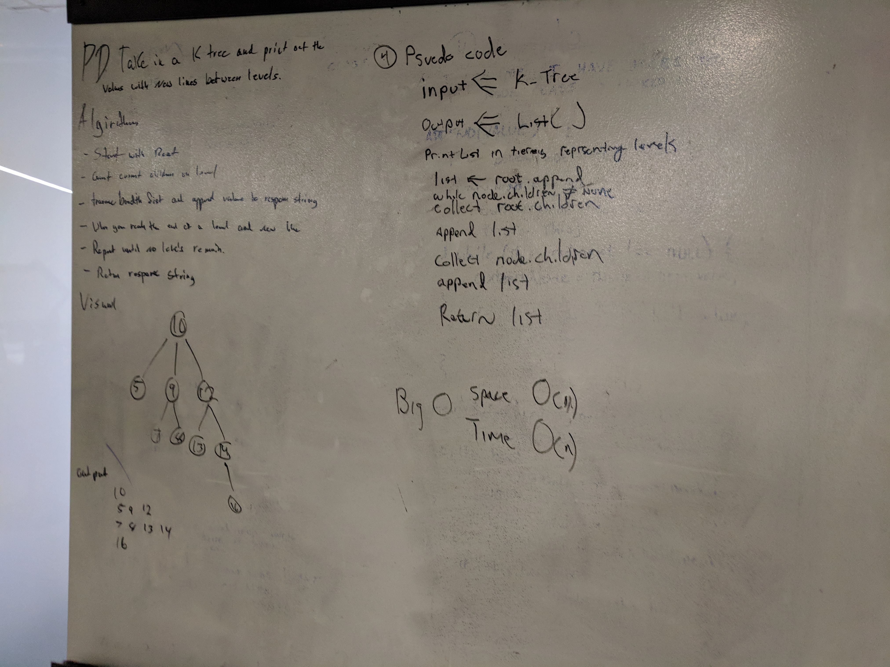

# Repeted Word
A whiteboard challenge intended to help us understand data structures. 

## Challenge
Write a function that accepts a lengthy string parameter.
Without utilizing any of the built-in library methods available to your language, return the first word to occur sequentially more than once in that provided string.

## Solution
