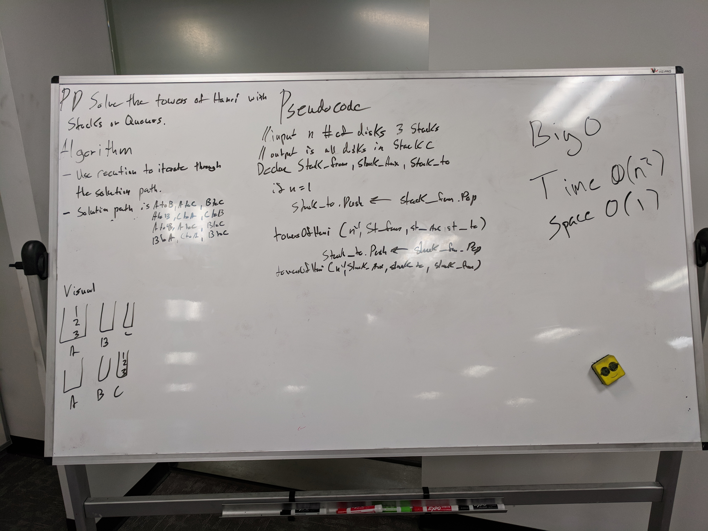

# Towers of Hanoi

A white board challenge intedned to help us explore data structures.

## Challenge

The Towers of Hanoi is a mathematical puzzle where you have 3 towers and N disks of different sizes.
The puzzle starts with the disks sorted (i.e. smaller disks sits on top of larger disks) on the left-most tower, and the objective of the puzzle is to move the disks to the right-most tower with the following restrictions:

- Only one disk can be moved at a given time.
- A disk is moved from the top of a tower to the top of another tower.
- A disk can't be placed on top of a smaller disk.

## Solution

I am using my own implimentation of a Stack and Node in this problem for practice.

The solution path for the puzzle in the case was harder than the implimentation. After some research I settled on the solution path as follows:

- A to B | A to C | B to C
- A to B | C to A | C to B
- A to B | A to C | B to C
- B to A | C to A | B to C

Once I settled on a recurring pattern figuring out the recursive steps was much simpler.
I set up the base case to be when we only had one disk left to move. The recursive case rotates the tower position makes the move, prints the move to the console and then continues the process.

