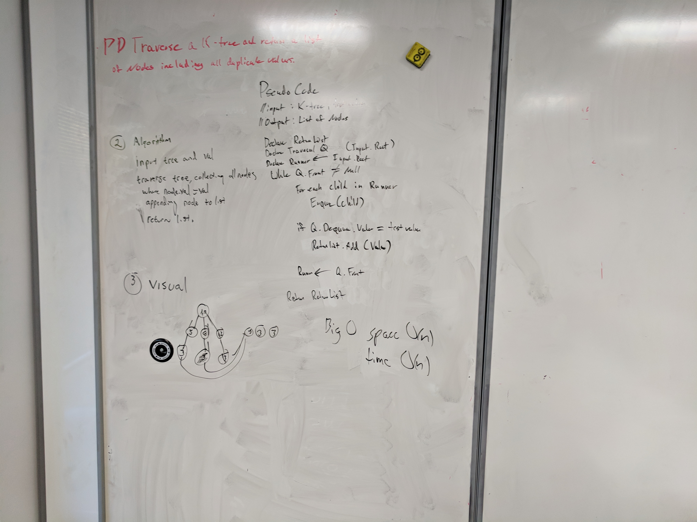

# Find matches

Trees are a non-linear data structure based on a hierarchical structure. Starting from the Root node a tree connects nodes with links/edges. A parent node can have one or more nodes descending from it, called child-nodes, but traditionally will not know its own parent node. A non-root parent node is also called an internal node. A node that has no child-nodes is called a leaf-node. A common type of tree is called a k-ary tree. K-ary meaning any node can have any number of child-nodes.

## Challenge

Write a function that takes a k-ary tree with non-unique values and a target value.
Return a collection of all the nodes from within the tree that match the provided value.
Avoid utilizing any of the built-in methods available to your language.

## [Solution](./)

Since the target values can be anywhere within the tree I decided to go with an iterative breadth first approach implemented with a queue. As we dequeue we store the node value and compare it with our target value. If it matches we add it to our return list. Once the traversal is done we return the list.

