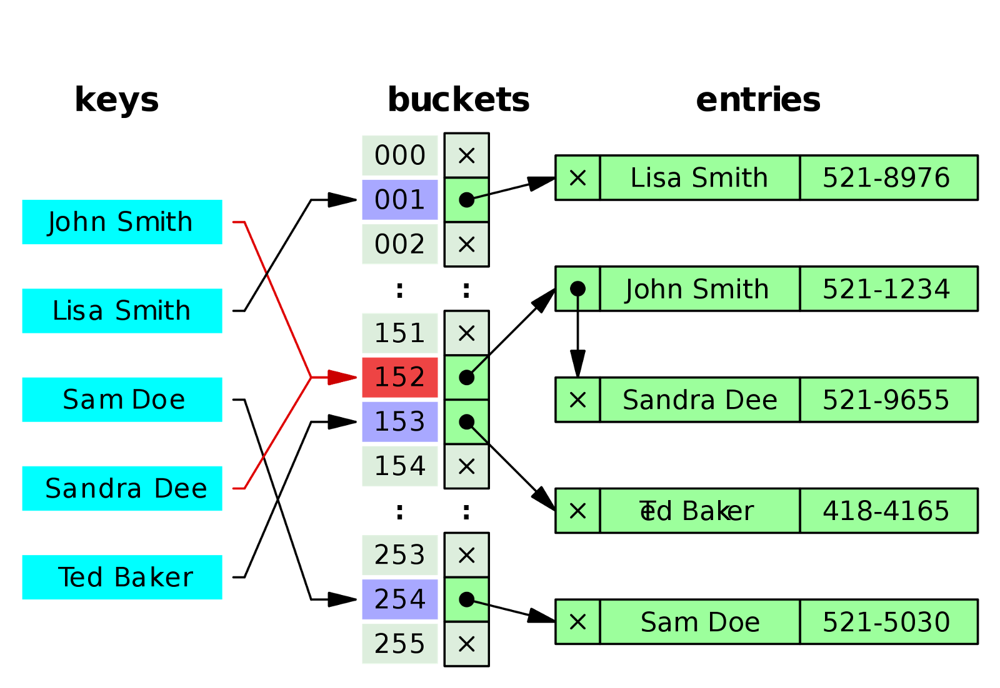

# Hash Table
A whiteboard challenge intended to help us understand data structures. 

## Explination
A Hash table is a collection of key value pairs where the key is hashed into an index. Subsequent lookups are then very fast.
Collisons occur when two unique values hash out to the same index. Most hash tables handle collisons with linked lists contining the valuse at the hashed index location. Hash tables are useful for finding duplicate items in a collection or providing fast lookup times.

## Visual

## Challenge
Upon completion, your Hashtable should be able to handle the following:

Add an item to a hashtable.(Method name: Add(key, value))
Get a value from a key (Method name: Contains(key))
Make a hashing algorithm that will determine and set the Key of your Key/Value Pair(Method Name: GetHash(key))
Handle collisions in the event that 2 values equal the same key

## Resources
https://en.wikipedia.org/wiki/Hash_table