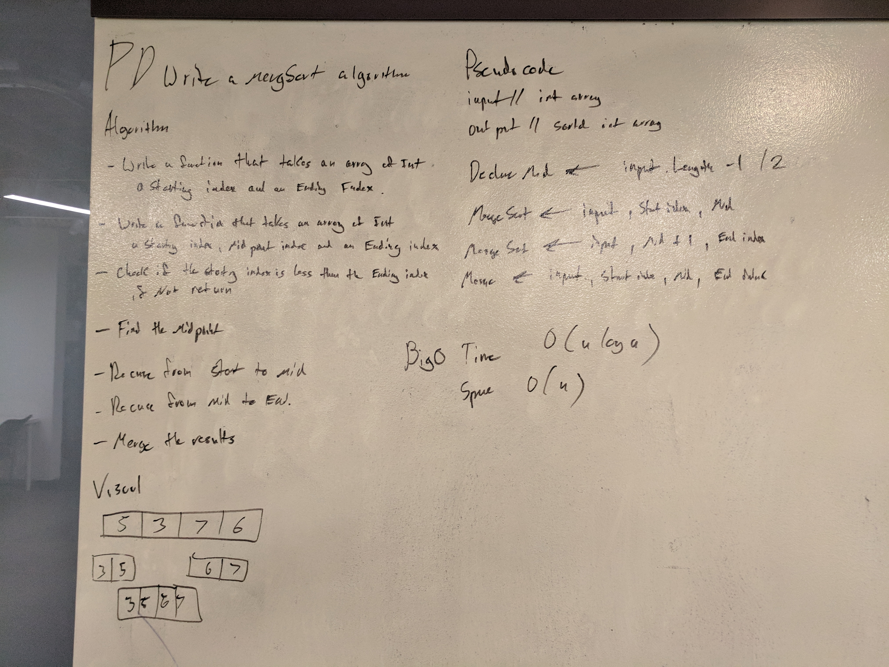

# Merge Sort
A whiteboard challenge intended to help us understand sorting algorithms. 

## Challenge
Write a function that accepts an array of unsorted integers, and returns a sorted array by a recursive mergesort algorithm.

## Solution

##Colaberation
Josh Taylor and Brnet W