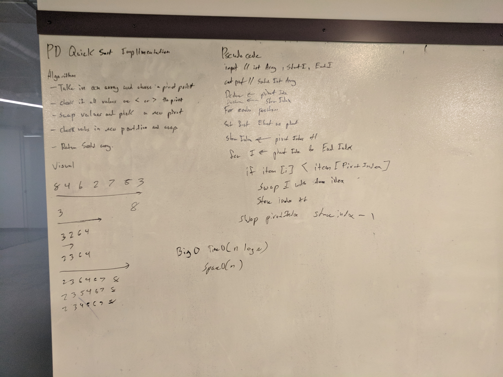

# Quick sort
A whiteboard challenge intended to help us understand sorting algorithms. 

## Challenge
Write a function that accepts an array of integers, and returns an array sorted by a recursive quicksort algorithm.

## Solution
